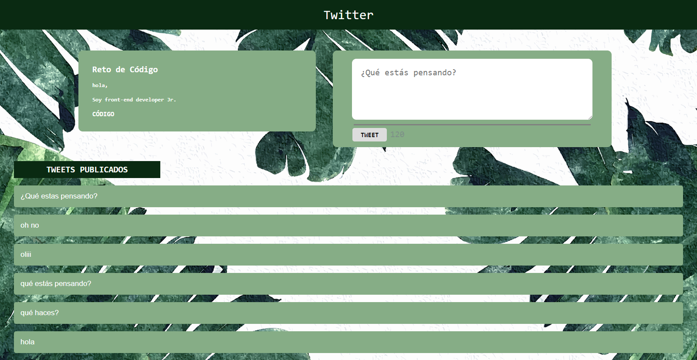

## TWITTER
### Replica de la la funcionalidad al publicar un tweet en la pagina web de Twitter

#### \[HTML] \[CSS] \[JavaScript]

#### Código HTML
    <!DOCTYPE html>
    <html>
      <head>
        <meta charset="utf-8">
        <title>Twitter</title>
        <link rel="stylesheet" href="css/main.css">
      </head>
      <body>
        <header>
          <a>Twitter</a>
        </header>
        <main>
          

            <h2>Reto de Código</h2>
            <h4>hola,</h4>
            <h4>Soy front-end developer Jr.</h4>
            <h3>CÓDIGO</h3>
          

          

            <textarea id="insert" type="text"  placeholder="¿Qué estás pensando?" autofocus></textarea>
            

            

              <button  id="save">TWEET</button>
              
140

            

          

        </main>
        

            <h2 class="all_the_tweets">TWEETS PUBLICADOS</h2>
            

        

        
      </body>
    </html>

#### Código CSS
    *{
      font-family: monospace;
    }
    body{
      margin: 0;
      padding: 0;
      width: 100% auto;
      background-image: url("../assets/image/fondo.jpg");
    }
    header{
      margin: 0;
      padding: 0;
      text-align: center;
      width: 100%;
      background-color: #0A2A12;
      padding: 1% 0 1% 0;
    }
    main{
      margin-top: 3%;
      padding:0;
      /*outline: 1px solid black;*/
      text-align: center;
      display:block;
    }
    a{
      font-size: 30px;
      color: white;
    }
    .reto_de_codigo{
      vertical-align:top;
      /*outline: 1px solid green;*/
      margin: 0% 1% 1% 0;
      padding:1% 20% 1% 2%;
      text-align: left;
      background-color:#86AD86;
      display: inline-block;
      color: white;
      border-radius: 10px;
    }
    h3{
      color: white;
      font-weight: bold;
    }
    .write_here{
      /*outline: 1px solid blue;*/
      margin: 0% 1% 1% 1%;
      width: 40%;
      display: inline-block;
      background-color: #86AD86;
      border-radius: 10px;
    }
    textarea{
      /*outline: 1px solid orange;*/
      margin-top: 3%;
      padding: 20px;
      font-size: 20px;
      width: 80%;
      height: 100px;
      border: hidden;
      border-radius: 10px;
    }
    .boton_caracteres{
      /*outline: 1px solid blue;*/
      text-align: left;
    }
    button{
      font-weight: bolder;
      font-size: 15px;
      margin-left: 7%;
      margin-bottom: 2%;
      padding: 1% 3% 1% 3%;
      display: inline;
      border: none;
      border-radius: 5px;
      outline: none;
    }
    button:hover{
      background-color:#0A2A12;
      color:white;
    }
    .characters{
      display: inline-block;
      font-size: 20px;
      display: inline;
    }
    hr{
      width: 85%;
      height: 3px;
      background-color: grey;
      border: none;
    }
    .all_the_tweets{
      font-weight: bolder;
      font-size: 20px;
      background-color: #0A2A12;
      color: white;
      width: 20%;
      margin-left: 2%;
      padding: 0.5%;
      text-align: center;
    }
    p{
      background-color: #86AD86;
      color:white;
      margin-left: 2%;
      margin-right: 2%;
      padding: 15px;
      border-radius: 5px;
      font-size: 17px;
      font-family:sans-serif;
     }

#### Código javascript
    var characters = document.getElementById('insert');
    var boton = document.getElementById('save');
    var tweetsPublicados = document.getElementById('container-tweets');
    //  creando función que cuenta n° de caracteres ingresados
    characters.addEventListener('keyup', function(event) {
      var numberCharacters = document.getElementById('number_characters');
      var size = characters.value.length;
      var max = 140;
      var finalSize = numberCharacters.textContent = (max - size);
      // si los caracteres pasan los 140, desabilitar el boton
      if (finalSize <= 0) {
        boton.disabled = true;
        numberCharacters.style.color = 'red';

        // cambiar contador a color morado si hay más de 120 caracteres
      } else if (finalSize <= 20 && finalSize > 10) {
        boton.disabled = false;
        numberCharacters.style.color = 'purple';
        // cambiar contador a color fucsia si hay más de 130 caracteres
      } else if (finalSize < 10 && finalSize >= 0) {
        boton.disabled = false;
        numberCharacters.style.color = '#FF1493';
      } else if (finalSize < 0) {
        boton.disabled = false;
        numberCharacters.style.color = 'red';
      } else {
        boton.disabled = false;
        numberCharacters.style.color = '#7788' ;
      }
    });
    // creando función que allacene lo que es cribe en el textArea para que lo muestre como tweets en un parrafo
    boton.addEventListener('click', function(event) {
      if (characters.value) {
        var tweet = document.createElement('p');
        var textTweet = document.createTextNode('');
        textTweet.textContent = characters.value;
        tweet.appendChild(textTweet);
        tweetsPublicados.appendChild(tweet);
        tweetsPublicados.insertBefore(tweet, tweetsPublicados.firstElementChild);
        characters.value = '';
      };
    });
